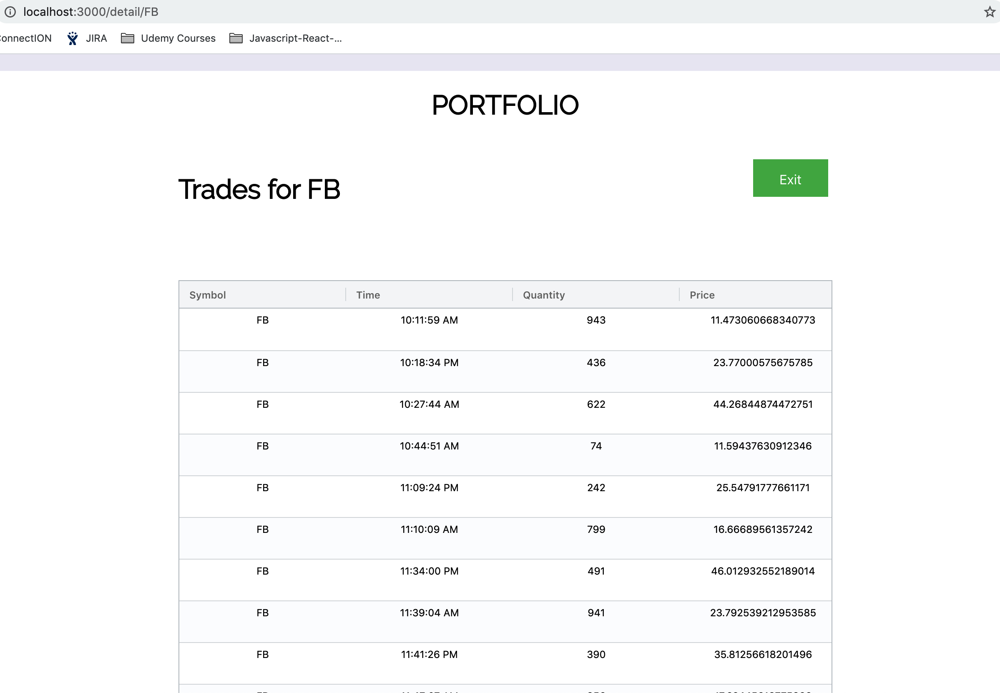
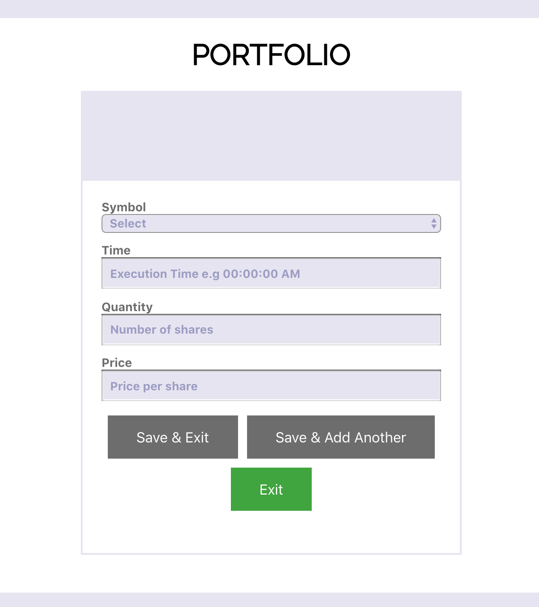

## Introduction
This is a little project I've been working on to learn front-end development with React. On this website, users can view their portfolio and make trades. The idea here is to build a React website that works with async http requests to fetch/update data and present the data using Javascript charting frameworks (such as agGrid and HighCharts).

## User Experience
Trades data, the trades have been placed by the user, is acquired from a mock rest endpoint and presented to the user as a donut chart, showing the allocation of a portfolio: 

 

Users can click on the donut chart and will be taken to a table showing all the trades relating to this particular ticker:

 

Users can also place trades using the trade entry form:

 

## How to run?

In the project directory, you can run:

### `node server.js`

Start the mock server that serves the JSON trades data used for visualizations. 

### `npm start`

Runs the app in the development mode. 
Open [http://localhost:3000](http://localhost:3000) to view it in the browser.

The page will reload if you make edits. 
You will also see any lint errors in the console.

### `npm test`

Launches the test runner in the interactive watch mode. 
See the section about [running tests](https://facebook.github.io/create-react-app/docs/running-tests) for more information.

### `npm run build`

Builds the app for production to the `build` folder. 
It correctly bundles React in production mode and optimizes the build for the best performance.

The build is minified and the filenames include the hashes. 
Your app is ready to be deployed!

See the section about [deployment](https://facebook.github.io/create-react-app/docs/deployment) for more information.

##

